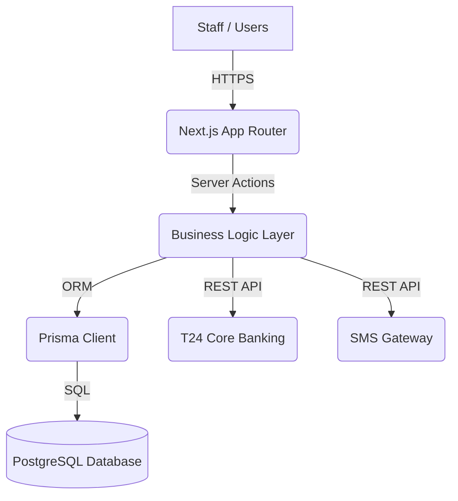

# **High Level Design (HLD)**

## **1. Introduction**
The **NIB Customer Onboarding Middleware** (NCOM) serves as a bridge between the bank's frontline staff and the T24 core banking system. Its primary purpose is to ensure data quality, implement a robust two-stage approval workflow, and handle secure synchronization of customer information.

---

## **2. Architecture Overview**

### **2.1 High-Level Component Diagram**

### **2.2 Design Principles**
- **Layered Architecture**: Clear separation between UI (React Components), Business Logic (Server Actions), and Data Access (Prisma).
- **Stateless Communication**: NextAuth.js manages sessions securely across requests.
- **Single Source of Truth**: The PostgreSQL database maintains the definitive state of every onboarding record.
- **Strict Payload Compliance**: T24 payloads are strictly whitelisted and validated using Zod.

---

## **3. System Components**

### **3.1 Frontend (Next.js)**
- **Dashboard**: A unified interface for viewing onboarding status and reviewing records.
- **Form Management**: Dynamic forms with real-time validation (React Hook Form + Zod).
- **Admin Panel**: Dedicated interfaces for managing organizational hierarchies (Offices, Branches, etc.).
- **Client Components**: Interactive elements like modals, search, and status badges.

### **3.2 Backend (Next.js Server Actions)**
- **`customer-onboarding.ts`**: Core business logic for submission, stage-wise review, and T24 synchronization.
- **`auth.ts`**: NextAuth configuration and role-based middleware.
- **`security-logger.ts`**: Captures and persists security-sensitive events.
- **`sms.ts`**: Handles external communication with the SMS gateway.

### **3.3 Data Layer (Prisma & PostgreSQL)**
- **`User`**: Stores user credentials, roles, and organizational unit links.
- **`CustomerOnboarding`**: The central entity for storing all customer details and approval metadata.
- **`CustomerOnboardingAuditLog`**: Captures the full lifecycle of each onboarding record.
- **Organizational Entities**: `Office`, `Department`, `Division`, `District`, `Branch`.

---

## **4. Integration Design**

### **4.1 T24 Core Banking Synchronization**
- **Endpoint**: `/CustomerCreate` (REST API).
- **Workflow**: 
  1. Record reaches `PENDING_APPROVER` status.
  2. Approver confirms, status becomes `AWAITING_T24_RESPONSE`.
  3. System builds whitelisted payload.
  4. POST request sent to T24.
  5. Response parsed; if successful, status becomes `APPROVED`.
  6. Account numbers/messages are stored in `forwardResponse`.

### **4.2 SMS Notification Gateway**
- **Workflow**:
  1. Record reaches final state (`APPROVED` or `REJECTED`).
  2. System triggers `sendSms` with the customer's mobile number.
  3. SMS status (SENT/FAILED) and timestamps are updated on the record.

---

## **5. Security Architecture**

### **5.1 Role-Based Access Control (RBAC)**
- Access to specific server actions and UI routes is strictly enforced based on the user's role permissions (e.g., `verifier_customer_onboarding`, `approver_customer_onboarding`).

### **5.2 Data Protection**
- **Sensitive Data**: Passwords are hashed using bcrypt.
- **Idempotency**: Payload hashing ensures data consistency and prevents duplicate submissions.
- **Audit Trails**: Comprehensive logging of every action ensures accountability.

---

## **6. Scalability & Availability**
- **Horizontal Scaling**: The Next.js application can be deployed in a containerized environment (e.g., Docker/Kubernetes) to handle increased load.
- **Database Resilience**: PostgreSQL can be configured for high availability (primary-replica setup).
- **Concurrency**: Database-level transactions ensure that multiple users can process onboarding requests simultaneously without data corruption.
