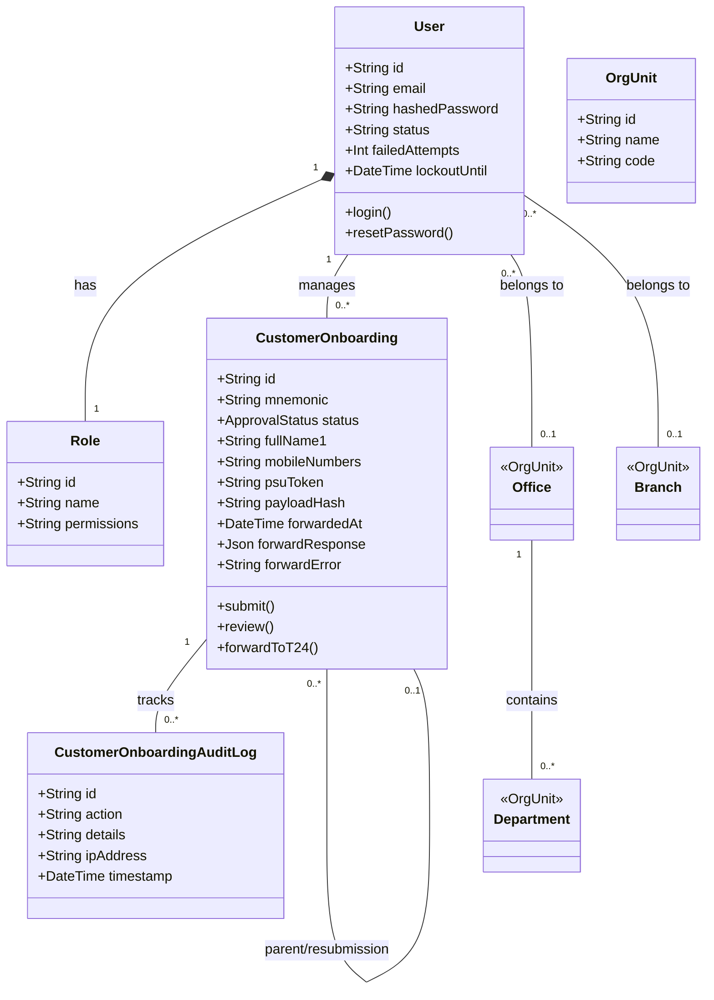
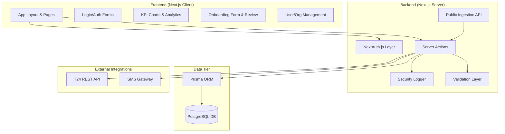

# **4. LLD Contents**

## **1. Introduction**

### **1.1 Purpose of the LLD Document**
This Low-Level Design (LLD) document provides a detailed technical specification for the **NIB Customer Onboarding Middleware (NCOM)**. It translates the high-level requirements into a granular architectural blueprint, detailing data models, server actions, UI components, and integration logic for developers and system maintainers.

#### **1.1.1 In Scope Features**
- **User Authentication**: Secure login via NextAuth.js.
- **Role-Based Access Control (RBAC)**: Permission-based access to review and admin panels.
- **Customer Onboarding Workflow**: Multi-stage (Maker-Checker) review process.
- **T24 Core Banking Integration**: Automated payload generation and REST API synchronization.
- **SMS Notifications**: Automated alerts via external SMS gateway.
- **Audit Logging**: Comprehensive tracking of all system actions.
- **Admin Modules**: Organizational unit and user management.

#### **1.1.2 Out-of-Scope**
- Modification of T24 internal business logic.
- Direct management of customer accounts post-creation.
- Physical document archival.

#### **1.1.3 Assumptions and Constraints**
- **Assumptions**: External data sources provide T24-compliant identifiers; T24 REST API is available on the bank's internal network.
- **Constraints**: Mandatory separation of duties (Maker-Checker); strict adherence to T24 whitelisted payload schemas.

#### **1.1.4 Audience for the Document**
- Software Developers and System Architects.
- IT Operations and Database Administrators.
- Quality Assurance (QA) Engineers.
- Internal IT Audit team.

### **1.2 Significance of The project**
The NCOM project eliminates manual data entry bottlenecks, reduces human error in core banking records, and ensures regulatory compliance through automated internal controls and audit trails.

### **1.3 System Design and Analysis**

#### **1.3.1 Development Environment**
- **OS**: Windows / Linux / macOS.
- **Node.js**: v20+ (LTS).
- **Package Manager**: npm.
- **Database**: PostgreSQL 15+.

#### **1.3.2 Development Tools**
- **Framework**: Next.js 15 (App Router).
- **ORM**: Prisma.
- **Language**: TypeScript.
- **Styling**: Tailwind CSS & Radix UI (shadcn/ui).
- **Validation**: Zod.

#### **1.3.3 Testing Procedures**
- **Unit Testing**: Testing individual server actions and utility functions.
- **Integration Testing**: Testing the interaction between the Next.js API/Server Actions and the PostgreSQL database.
- **System Testing**: End-to-end testing of the onboarding workflow from submission to T24 sync.
- **Acceptance Testing (UAT)**: Validating features against business requirements with stakeholders.

### **1.5 Acronyms and Definitions**
- **NCOM**: NIB Customer Onboarding Middleware.
- **RBAC**: Role-Based Access Control.
- **LLD**: Low-Level Design.
- **ICV**: Internal Control Violation.
- **T24**: Temenos T24 Core Banking System.

---

## **2. System functionality Overview**
The system receives customer data, validates it against business rules, and places it in a **Maker-Checker** pipeline. A **Verifier** performs Stage 1 review, followed by automated **T24 Synchronization**. Finally, an **Approver** performs Stage 2 authorization to finalize the onboarding.

---

## **3. Detailed Design**

### **3.1 Use Case Diagram**
```mermaid
useCaseDiagram
    actor "Submitter" as S
    actor "Verifier" as V
    actor "Approver" as A
    actor "Admin" as Admin

    package "NCOM System" {
        package "Authentication" {
            usecase "Login / Logout" as UC_Auth
            usecase "Set/Change Password" as UC_Pass
        }
        
        package "Onboarding Operations" {
            usecase "Create Onboarding Request" as UC_Create
            usecase "Resubmit Rejected Application" as UC_Resubmit
            usecase "View My Pipeline" as UC_Pipe
            usecase "Verify Record (Stage 1)" as UC_Verify
            usecase "Sync with T24" as UC_Sync
            usecase "Authorize Record (Stage 2)" as UC_AuthRecord
        }

        package "Monitoring & Admin" {
            usecase "View KPI Dashboard" as UC_KPI
            usecase "Export Data Reports" as UC_Export
            usecase "Manage Users & Roles" as UC_Users
            usecase "Manage Bank Structure" as UC_Org
            usecase "View Audit & Security Logs" as UC_Logs
        }
    }

    S --> UC_Auth
    S --> UC_Create
    S --> UC_Resubmit
    S --> UC_Pipe
    S --> UC_KPI

    V --> UC_Auth
    V --> UC_Verify
    V --> UC_KPI
    V --> UC_Pipe

    A --> UC_Auth
    A --> UC_AuthRecord
    A --> UC_KPI
    A --> UC_Pipe
    UC_AuthRecord ..> UC_Sync : <<triggers>>

    Admin --> UC_Auth
    Admin --> UC_Users
    Admin --> UC_Org
    Admin --> UC_Logs
    Admin --> UC_KPI
    Admin --> UC_Export
```

### **3.2 Description of the Component**

#### **3.2.1 Login Component**
- **Implementation**: `src/app/login/page.tsx` & `src/lib/auth.ts`.
- **Logic**: Uses NextAuth.js with a Credentials Provider. Validates user status and increments failed login attempts for security.

#### **3.2.2 Register Admin**
- **Implementation**: Initial seeding script `prisma/seed.ts`.
- **Logic**: Creates a super-user with the `admin` permission string to bootstrap the system.

#### **3.2.3 Register Internal User**
- **Implementation**: `src/app/dashboard/admin/users/page.tsx`.
- **Logic**: Admins can create users and assign them to specific `Offices`, `Departments`, and `Roles`.

#### **3.2.4 Add Customer**
- **Implementation**: `src/app/actions/customer-onboarding.ts`.
- **Logic**: Captures customer data, generates a `payloadHash` for deduplication, and sets initial status to `PENDING`.

#### **3.2.5 Manage Customer Status**
- **Implementation**: `reviewCustomerOnboarding` server action.
- **Logic**: Transitions status based on reviewer action:
  - Verifier: `PENDING` -> `VERIFIER_APPROVED` / `VERIFIER_REJECTED`.
  - Sync: `VERIFIER_APPROVED` -> `PENDING_APPROVER` / `SYNC_FAILED`.
  - Approver: `PENDING_APPROVER` -> `APPROVED` / `REJECTED`.

### **3.3 Class Diagram**


### **3.4 Component Diagram**


---

## **4. Testing**

### **4.1 Unit Testing**
Focuses on pure functions like `image-processor.ts`, `password-policy.ts`, and Zod schema validations in `customer-onboarding.ts`.

#### **4.1.2 Integration Testing**
Tests the flow between Server Actions and the Prisma ORM to ensure database constraints and transactions are functioning as expected.

#### **4.1.3 System Testing**
End-to-end testing of the complete onboarding lifecycle, including mock API calls to the T24 and SMS gateways.

#### **4.1.4 Acceptance Testing**
Stakeholder verification of the user interface and business rules against the SRD.

---

## **5. Deployment**

### **5.1 Target Platform**
- **Platform**: Firebase App Hosting or any Node.js-compatible PaaS.
- **Configuration**: `apphosting.yaml` configured with `maxInstances: 1` for consistent session handling and resource management.

### **5.2 Build and Production Commands**
- **Build Command**: `npm run build` (executes `next build`).
- **Production Command**: `npm run start` (executes the server with `NODE_ENV=production` on port 3020 by default, configurable via the `PORT` environment variable).

### **5.3 Database Operations**
- **Migrations**: 
  - `npx prisma db push` for rapid schema synchronization during development.
  - `npx prisma migrate deploy` for migration-based updates in production environments.
- **Seed Data**: `npx tsx prisma/seed.ts` (populates initial organizational units, roles, menu items, KYC fields, and sample data).

### **5.4 Required Environment Variables**
The following variables must be configured in the production environment:

| Variable | Requirement | Description |
| :--- | :--- | :--- |
| `DATABASE_URL` | **Required** | PostgreSQL connection string. |
| `SECRET_COOKIE_PASSWORD` | **Required** | Minimum 32-character secret for session encryption. |
| `REDIS_URL` | Optional | For distributed caching or session storage. |
| `SMTP_*` | Optional | `SMTP_HOST`, `SMTP_PORT`, `SMTP_USER`, `SMTP_PASS` for email notifications. |
| `ADMIN_INITIAL_*` | Optional | Initial admin credentials (email/password) if not using seed script. |

---

## **6. Reference**
- Temenos T24 REST API Documentation.
- Next.js Documentation.
- Prisma ORM Documentation.
- NIB Bank Internal IT Security Policy.
