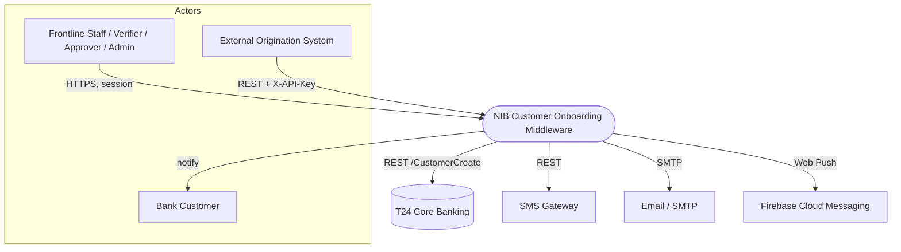
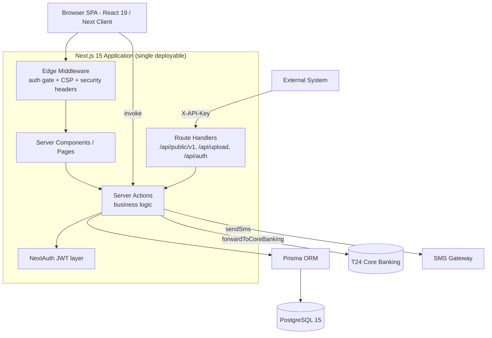
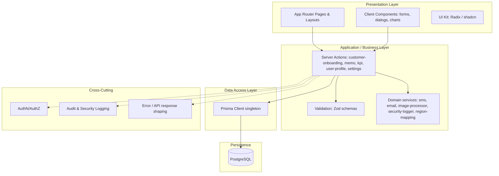
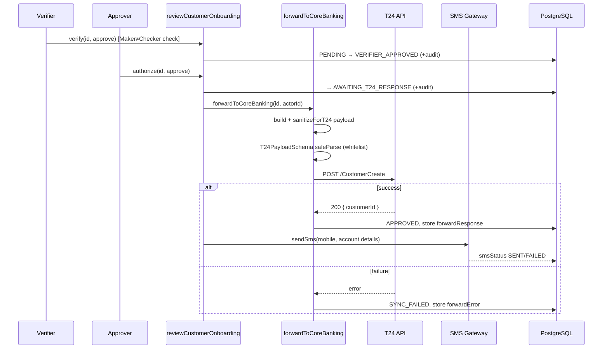
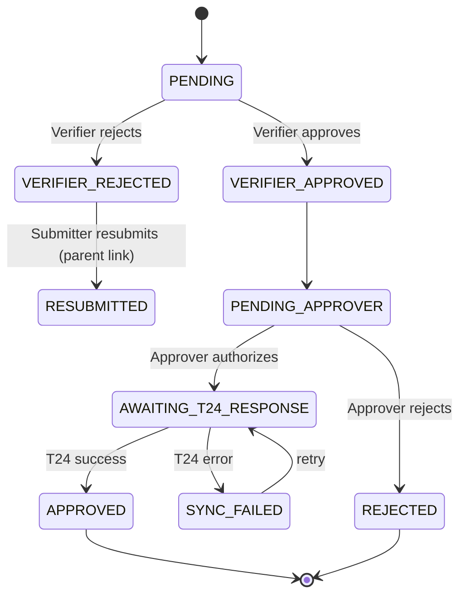
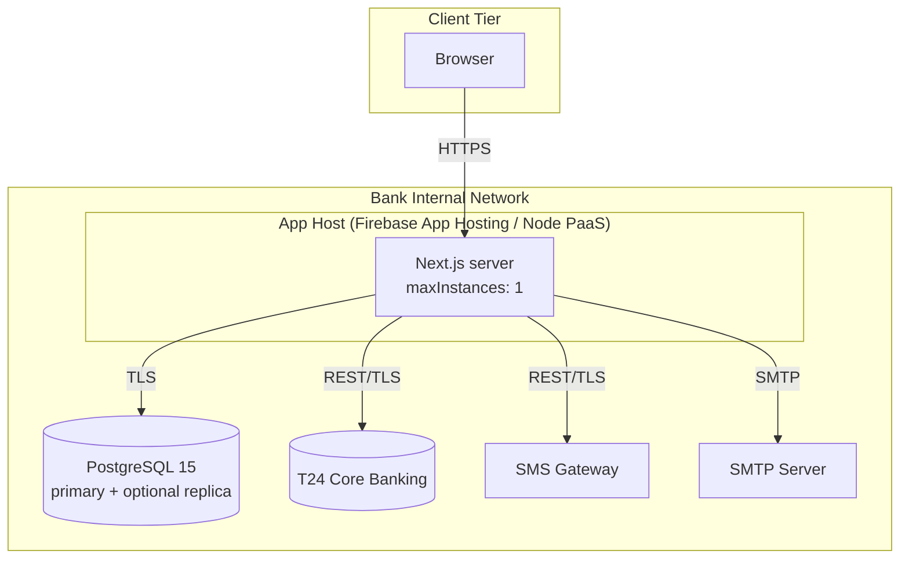
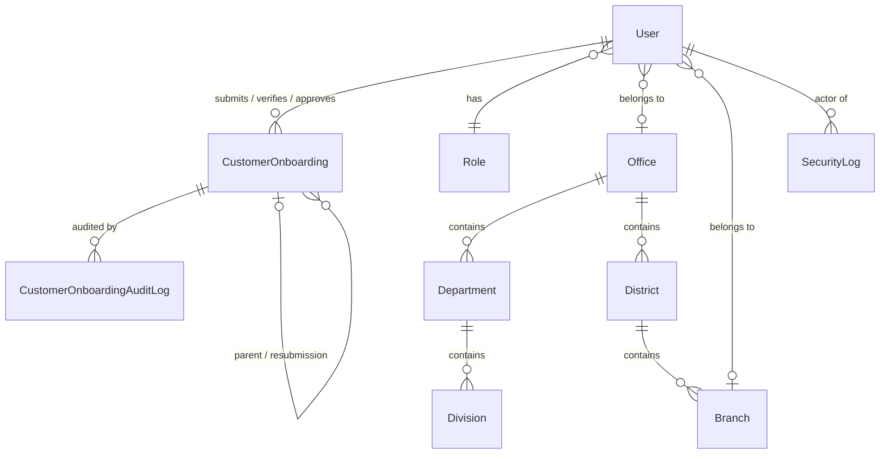
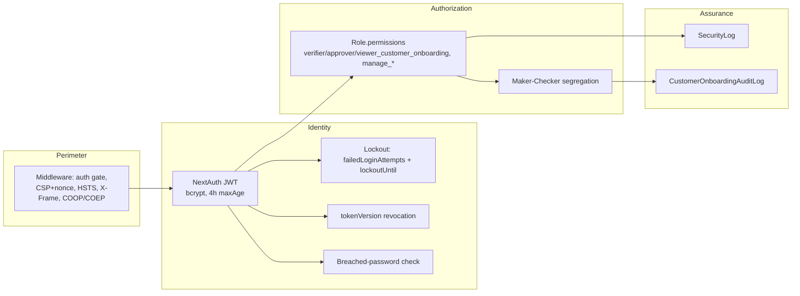

# **Software Architecture Design (SAD)**
### NIB Customer Onboarding Middleware (NCOM)

| | |
| :--- | :--- |
| **Document** | Software Architecture Design (SAD) |
| **System** | NIB Customer Onboarding Middleware (NCOM) |
| **Version** | 1.0 |
| **Status** | Draft for Review |
| **Owner** | Digital Banking / IT Architecture |
| **Related Docs** | [Project Charter](PROJECT_CHARTER.md) · [System Requirements (SRD)](SYSTEM_REQUIREMENTS.md) · [High-Level Design (HLD)](HIGH_LEVEL_DESIGN.md) · [Low-Level Design (LLD)](LOW_LEVEL_DESIGN.md) |

---

## 1. Introduction

### 1.1 Purpose
This Software Architecture Design describes the **significant structural decisions** of the NIB Customer Onboarding Middleware (NCOM): the components, their responsibilities, the runtime behavior of key scenarios, the data model, the integration boundaries, the security posture, and the rationale behind the choices. It is the bridge between *what the system must do* (SRD) and *how each unit is built* (LLD), and it is the reference used to evaluate change impact, onboard engineers, and conduct architecture/security review.

### 1.2 Scope
NCOM is a **middleware** that sits between the bank's data-capture channels (frontline web UI and system-to-system API) and the **Temenos T24 core banking system**. It validates customer data, enforces a two-stage **Maker–Checker** approval workflow, synchronizes approved customers into T24, and notifies customers via SMS — with a complete audit trail.

The same platform also hosts an **internal memo / correspondence subsystem** (Memo, Attachment, Delegation, Label, Activity) that shares the identity, organizational, and security backbone. This SAD focuses on the onboarding domain and treats the memo subsystem as a co-resident module on the shared foundation.

### 1.3 Definitions
| Term | Meaning |
| :--- | :--- |
| **NCOM** | NIB Customer Onboarding Middleware |
| **Maker–Checker** | Segregation-of-duties control: the creator of a record cannot approve it |
| **Verifier** | Stage-1 reviewer of an onboarding record |
| **Approver** | Stage-2 authorizer; approval triggers T24 sync |
| **T24** | Temenos T24 core banking system |
| **RBAC** | Role-Based Access Control |
| **Server Action** | Next.js server-side function invoked directly from React (RPC-style) |
| **Idempotency / payload hash** | SHA-256 of the submission payload used to detect duplicates |
| **PSU token** | Presentation alias derived from `legalIdNumber` / `nationalIDNumber` |

### 1.4 Stakeholders & Concerns
| Stakeholder | Primary architectural concern |
| :--- | :--- |
| Submitters / Frontline staff | Fast, guided data capture with immediate validation feedback |
| Verifiers / Approvers | Reliable Maker–Checker enforcement, clear record state |
| System Administrators | User/role/org management, least-privilege |
| Compliance / Internal Audit | Immutable, complete audit and security trails |
| IT Operations | Deployability, observability, integration health |
| Developers | Clear layering, cohesive modules, testability |

---

## 2. Architectural Goals & Constraints

### 2.1 Quality-Attribute Drivers (architecturally significant NFRs)
| Attribute | Target / Driver | Architectural response |
| :--- | :--- | :--- |
| **Integrity** | Only clean, T24-compliant data reaches core banking | Dual validation: inbound Zod schema + strict whitelisted `T24PayloadSchema` before egress |
| **Auditability** | Every state change and security event is traceable | `CustomerOnboardingAuditLog` (domain) + `SecurityLog` (security) + `EmailLog` |
| **Security** | Bank-grade controls, least privilege | RBAC, bcrypt, account lockout, JWT `tokenVersion` revocation, CSP w/ nonce, HSTS, breached-password check |
| **Idempotency** | Duplicate submissions must not create duplicate customers | SHA-256 `payloadHash` + `mnemonic` deduplication |
| **Reliability** | Partial failures must not corrupt state | Prisma transactions; T24/SMS failures captured as record state, not crashes |
| **Performance** | UI < 500 ms; T24 call ≤ 30 s | Server-side rendering + indexed queries; async integration with explicit `AWAITING_*` states |
| **Usability** | Responsive, accessible UI | Tailwind + Radix (shadcn/ui), React Hook Form live validation |

### 2.2 Constraints
- **Separation of duties is mandatory** — Submitter ≠ Verifier ≠ Approver, enforced in business logic.
- **T24 payload is a strict whitelist** — no field may reach T24 without passing `T24PayloadSchema`.
- **Single writer of record** — PostgreSQL is the sole source of truth for onboarding state.
- **Runtime**: Node.js 20+, PostgreSQL 15+, Next.js 15 App Router, TypeScript.
- **Deployment assumes single-instance session affinity** (`apphosting.yaml maxInstances: 1`); horizontal scaling requires externalizing rate-limit state (see §12 risks).

---

## 3. Architectural Representation (Views)

This SAD uses the **4+1 view model**. Each view answers a different stakeholder concern:

| View | Answers | Section |
| :--- | :--- | :--- |
| **Logical** | What are the components and how are they layered? | §4 |
| **Process / Runtime** | How do components collaborate at runtime? | §5 |
| **Development** | How is the code organized? | §6 |
| **Physical / Deployment** | Where does it run? | §7 |
| **Scenarios (+1)** | Key use cases tying the views together | §5.1–5.3 |

Supporting views: **Data architecture** (§8), **Integration** (§9), **Security** (§10).

---

## 4. Logical View

### 4.1 System Context (C4 – Level 1)


### 4.2 Container View (C4 – Level 2)


### 4.3 Layered Architecture
NCOM follows a strict **layered (n-tier) architecture** with dependencies pointing downward only.



### 4.4 Component Responsibilities
| Component | File(s) | Responsibility |
| :--- | :--- | :--- |
| Onboarding logic | `src/app/actions/customer-onboarding.ts` | Submit, dedup (hash/mnemonic), stage review, status transitions, T24 payload build + forward, SMS trigger |
| KPI/analytics | `src/app/actions/kpi.ts` | Pipeline metrics for dashboards |
| Memo subsystem | `src/app/actions/memo.ts` | Internal correspondence, holders, delegation |
| Auth | `src/lib/auth.ts`, `src/app/api/auth/[...nextauth]/route.ts` | Credentials login, JWT issuance, lockout, `tokenVersion` revocation |
| Authorization | `src/lib/permissions.ts`, `src/lib/types.ts` | Permission catalog + RBAC checks |
| Inbound validation | `src/lib/validations/customer-onboarding.ts` | Zod schema for capture/API payloads |
| Egress validation | `T24PayloadSchema` (in `customer-onboarding.ts`) | Strict whitelist for T24 |
| Integration services | `src/lib/sms.ts`, `src/lib/email.ts` | External comms + logging |
| Security logging | `src/lib/security-logger.ts` | Structured `SecurityLog` events + severities |
| Media | `src/lib/image-processor.ts`, `src/app/api/upload` | Photo/signature handling |
| Data access | `src/lib/prisma.ts` | Prisma singleton |
| Edge policy | `src/middleware.ts` | Route auth gate, per-request CSP nonce, security headers, HTTPS/HSTS |

---

## 5. Process / Runtime View

### 5.1 Scenario — External submission (system-to-system)
```mermaid
sequenceDiagram
    participant Ext as External System
    participant API as /api/public/v1/customer-onboarding
    participant Auth as authenticate()
    participant RL as Rate Limiter
    participant Zod as CustomerOnboardingSchema
    participant SA as submitCustomerOnboarding
    participant DB as PostgreSQL

    Ext->>API: POST (X-API-Key, JSON)
    API->>Auth: verify key or session
    Auth-->>API: {isSystem} | {user} | error
    API->>RL: checkRateLimit(key)  (50/min)
    RL-->>API: allow / 429
    API->>API: derive psuToken, map region label
    API->>Zod: safeParse(body)
    Zod-->>API: ok / 422 (formatZodError)
    API->>SA: submit(data, systemActor)
    SA->>SA: compute SHA-256 payloadHash + mnemonic
    SA->>DB: dedup check; insert PENDING + audit log
    DB-->>SA: id
    SA-->>API: {success, id}
    API-->>Ext: 201 {id}  (+ SecurityLog INFO)
```

### 5.2 Scenario — Two-stage review with T24 sync (core workflow)


> **Design note:** T24 sync is modeled as an explicit state (`AWAITING_T24_RESPONSE` → `APPROVED` | `SYNC_FAILED`) rather than a hidden side effect. This makes the integration **retryable** (`SYNC_FAILED` records can be re-forwarded) and **observable**.

### 5.3 Scenario — Authentication & session
```mermaid
sequenceDiagram
    participant U as User
    participant NA as NextAuth (Credentials)
    participant DB as PostgreSQL
    U->>NA: email + password
    NA->>DB: find user; check status & lockoutUntil
    alt valid
        NA->>NA: bcrypt.compare
        NA->>DB: reset failedLoginAttempts
        NA-->>U: JWT {id, permissions, tokenVersion}  (maxAge 4h)
    else invalid
        NA->>DB: increment failedLoginAttempts; set lockout if threshold
        NA-->>U: reject
    end
    Note over NA,DB: On each request the JWT tokenVersion is<br/>compared to DB; mismatch = forced re-login (revocation)
```

### 5.4 Onboarding State Machine


---

## 6. Development View

### 6.1 Package / Folder structure
```
src/
├─ middleware.ts              # edge auth gate, CSP nonce, security headers
├─ app/
│  ├─ (auth)/login/           # public auth entry
│  ├─ api/
│  │  ├─ auth/[...nextauth]/  # NextAuth route handler
│  │  ├─ public/v1/customer-onboarding/   # system-to-system REST API
│  │  ├─ internal/upload/  &  upload/      # media upload
│  ├─ dashboard/
│  │  ├─ customer-onboarding/ # capture + review UI (Maker–Checker)
│  │  └─ admin/               # users, roles, offices, branches, ... , security logs
│  └─ actions/                # SERVER ACTIONS = application layer
│     ├─ customer-onboarding.ts
│     ├─ kpi.ts  memo.ts  user-profile.ts  settings.ts
├─ lib/
│  ├─ auth.ts  permissions.ts  types.ts   # identity & RBAC
│  ├─ validations/customer-onboarding.ts  # inbound Zod
│  ├─ sms.ts  email.ts  image-processor.ts # domain services
│  ├─ security-logger.ts  region-mapping.ts  api-response.ts
│  └─ prisma.ts                            # data-access singleton
├─ components/                # UI: forms, dialogs, charts, ui/* (shadcn)
└─ hooks/                     # use-idle-timeout, use-mobile, ...
prisma/
├─ schema.prisma             # single source of the data model
├─ migrations/               # versioned DDL
└─ seed.ts                   # roles, org units, KYC fields, sample data
```

### 6.2 Conventions
- **Server Actions are the application boundary.** Both Server Components and the public API route call the *same* action functions — no duplicated business logic.
- **Validation at every boundary.** Inbound = `CustomerOnboardingSchema`; egress = `T24PayloadSchema`. Never trust upstream data.
- **Uniform API envelope** via `src/lib/api-response.ts` (`successResponse` / `errorResponse` / `formatZodError`) with stable machine codes (`VALIDATION_ERROR`, `RATE_LIMIT_EXCEEDED`, `CONFLICT`, …).
- **Prisma client as a singleton** to avoid connection exhaustion in dev/hot-reload.

### 6.3 Technology stack
| Layer | Technology |
| :--- | :--- |
| Framework | Next.js 15 (App Router), React 19, TypeScript 5 |
| Styling / UI | Tailwind CSS, Radix UI (shadcn/ui), Recharts, Framer Motion |
| Forms / validation | React Hook Form, Zod |
| Auth | NextAuth v4 (Credentials + JWT), bcrypt |
| ORM / DB | Prisma 5, PostgreSQL 15 |
| Integrations | T24 REST, SMS gateway, Nodemailer (SMTP), Firebase (push) |
| Runtime port | `3012` (dev/start per `package.json`) |

---

## 7. Physical / Deployment View



### 7.1 Environments & configuration
| Variable | Req. | Purpose |
| :--- | :--- | :--- |
| `DATABASE_URL` | ✅ | PostgreSQL connection |
| `NEXTAUTH_URL` | ✅ | Canonical URL; **also gates HTTPS/HSTS enforcement** in middleware |
| `SECRET_COOKIE_PASSWORD` / NextAuth secret | ✅ | Session/JWT signing (≥ 32 chars) |
| `ONBOARDING_API_KEY` | ✅ (API) | System-to-system auth for public API |
| `T24_API_URL`, `T24_API_KEY` | ✅ (sync) | Core-banking egress endpoint + auth |
| `SMTP_*` | Optional | Email notifications |
| `REDIS_URL` | Optional | Externalized cache/session/rate-limit (future HA) |

### 7.2 Build & operations
- **Build:** `npm run build` · **Run:** `npm run start` · **Types:** `npm run typecheck`
- **DB:** `prisma migrate deploy` (prod) / `prisma db push` (dev); `prisma/seed.ts` bootstraps roles, org units, KYC config.

---

## 8. Data Architecture

### 8.1 Core entity relationships


### 8.2 Key data-model decisions
- **`CustomerOnboarding` is a wide aggregate** capturing KYC identity, address, contact, legal ID, banking classification, and integration metadata (`forwardedAt/Response/Error`, `sms*`) in one row — matching T24's single-record ingestion model and simplifying the audit story.
- **Resubmission chaining:** `parentCustomerId` self-relation preserves full lineage of rejected → resubmitted attempts (`mnemonic` intentionally non-unique).
- **Idempotency:** `payloadHash` (SHA-256) + `mnemonic` prevent duplicate customers.
- **Two audit surfaces:** domain-level `CustomerOnboardingAuditLog` (record lifecycle) and system-level `SecurityLog` (authN/Z, denials, integration failures) with severity `INFO|WARN|CRITICAL`.
- **Deliberate indexing** on `approvalStatus`, `mnemonic`, actor FKs, `createdAt`, and search fields (`fullName1`, `mobilePhoneNumbers`, …) to keep pipeline/dashboard queries under budget.
- **Org hierarchy is two-pronged:** `Office → Department → Division` (functional) and `Office → District → Branch` (geographic).

---

## 9. Integration Architecture

| Integration | Direction | Mechanism | Failure handling |
| :--- | :--- | :--- | :--- |
| **Public onboarding API** | Inbound | `POST/GET /api/public/v1/customer-onboarding`; dual auth (`X-API-Key` **or** session); in-memory rate limit 50/min | 401/403/422/429/409 with machine codes; every attempt security-logged |
| **T24 core banking** | Outbound | `forwardToCoreBanking` → `POST /CustomerCreate`; strict `T24PayloadSchema` whitelist + `sanitizeForT24`; response tolerant parser | `SYNC_FAILED` state + `forwardError`; retryable; never blocks the approval record |
| **SMS gateway** | Outbound | `sendSms` on final state | `smsStatus`/`smsError` on record; non-fatal |
| **Email (SMTP)** | Outbound | Nodemailer | Persisted to `EmailLog` (`sent`/`failed`) |
| **Firebase push** | Outbound | Client web push notifications | Best-effort |

**Anti-corruption boundary:** the T24 wire format is isolated behind the payload builder + `T24PayloadSchema`. Internal fields (e.g., `region` label) are translated to T24 IDs via `region-mapping.ts`, so upstream schema changes don't leak into the core-banking contract.

---

## 10. Security Architecture



- **Transport & headers:** per-request CSP with cryptographic nonce + `strict-dynamic`; `X-Frame-Options: DENY`, `frame-ancestors 'none'`, COOP/COEP/CORP, strict `Permissions-Policy`; HTTPS redirect + HSTS **gated on the real scheme** (`NEXTAUTH_URL`) to avoid breaking plain-HTTP internal deployments.
- **AuthN:** bcrypt password hashing, account lockout, breached-password rejection (`pwned-password.ts`), 4-hour JWT, idle-timeout on the client, and **server-side revocation** via `tokenVersion` compared against the DB on every request.
- **AuthZ:** permission strings on `Role`; UI routes and Server Actions both gate on permissions; Maker–Checker prevents self-approval.
- **Data protection:** payload hashing for idempotency; secrets/tokens (`hashedPassword`, `tokenVersion`) stripped from serialized user objects.
- **Assurance:** dual logging (domain + security) provides a defensible, queryable trail for Internal Audit.

---

## 11. Cross-Cutting Concerns
| Concern | Approach |
| :--- | :--- |
| **Validation** | Zod at both boundaries; single schema reused by UI + API |
| **Error handling** | Uniform envelope + machine codes; integration errors captured as record state, not exceptions |
| **Logging/observability** | `SecurityLog` (severity-tagged), `CustomerOnboardingAuditLog`, `EmailLog`; integration console traces |
| **Idempotency** | SHA-256 `payloadHash` + `mnemonic` dedup |
| **Transactions** | Prisma transactions guard multi-step state changes |
| **Config** | Environment variables; behavior (e.g., HTTPS) derived from real runtime signals |

---

## 12. Architecturally Significant Decisions (ADR summary)
| # | Decision | Rationale | Trade-off / consequence |
| :--- | :--- | :--- | :--- |
| ADR-1 | **Next.js Server Actions as the business layer** (no separate API tier) | Single codebase, shared logic between UI and API, less boilerplate | Business logic coupled to Next.js runtime |
| ADR-2 | **Modular monolith**, not microservices | Small team, one bounded domain, simpler ops & transactions | Scales vertically first; module discipline required |
| ADR-3 | **T24 sync as explicit state machine** (`AWAITING_*`/`SYNC_FAILED`) | Retryable, observable, non-blocking | More statuses to manage |
| ADR-4 | **Strict egress whitelist (`T24PayloadSchema`)** | Protects core banking from bad/extra data | Schema must track T24 contract changes |
| ADR-5 | **JWT sessions + `tokenVersion` revocation** | Stateless yet revocable | DB check per request (mitigated by indexing) |
| ADR-6 | **Dual auth on public API** (API key or session) | Serves both system and human callers | Key management/rotation required |
| ADR-7 | **PostgreSQL single source of truth** | Consistency, transactions, auditability | Requires HA setup for availability targets |

---

## 13. Risks & Technical Debt
| Risk / debt | Impact | Recommended direction |
| :--- | :--- | :--- |
| **In-memory rate limiter + `maxInstances: 1`** | Blocks horizontal scaling; limiter resets on restart | Externalize to Redis; make app stateless |
| **T24/SMS availability** | Sync/notification failures | Already retryable via state; add backoff + dead-letter/alerting |
| **Automated-test coverage** | Regression risk on critical workflow | Add unit tests (schemas, transitions) + e2e with mocked T24/SMS per LLD §4 |
| **Wide `CustomerOnboarding` aggregate** | Migration friction as KYC evolves | Acceptable now; revisit if fields diverge by product |
| **API key as sole system credential** | Rotation/exposure risk | Rotation policy; consider mTLS on internal network |

---

## 14. Traceability
This SAD realizes SRD requirements as follows:

| SRD requirement | Realized by |
| :--- | :--- |
| Two-stage Maker–Checker workflow | §5.2, §5.4 state machine, Maker–Checker enforcement (§10) |
| Data integrity / T24 compliance | Dual validation (§2.1, §9), `T24PayloadSchema` |
| Security & compliance | §10 security architecture, dual audit logs |
| T24 integration w/ error handling | §9, `forwardToCoreBanking`, `SYNC_FAILED` retry |
| SMS notifications | §9, `sendSms`, `sms*` fields |
| RBAC + admin modules | §10, `permissions.ts`, admin routes (§6.1) |
| Real-time KPI dashboards | `kpi.ts` action, Recharts UI |

---

## 15. References
- Temenos T24 REST API documentation
- Next.js 15 (App Router), Prisma 5, NextAuth v4 documentation
- NIB internal IT security policy
- Companion docs: [SRD](SYSTEM_REQUIREMENTS.md), [HLD](HIGH_LEVEL_DESIGN.md), [LLD](LOW_LEVEL_DESIGN.md), [Project Charter](PROJECT_CHARTER.md)
